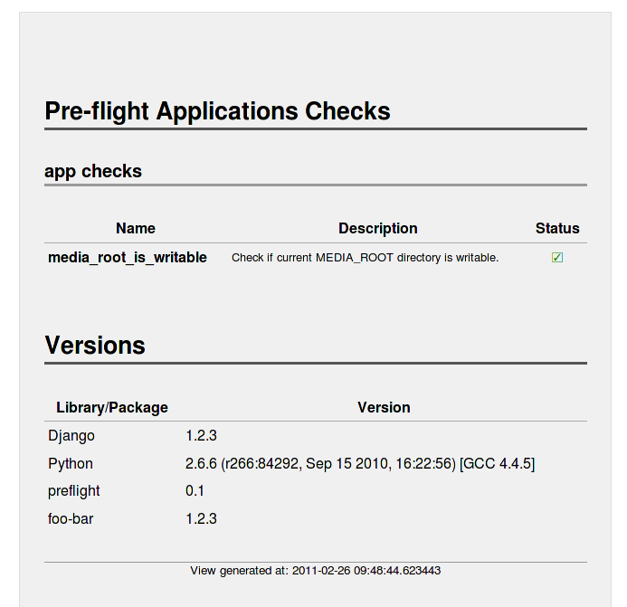
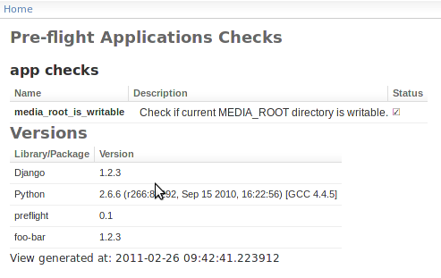

.. django-preflight documentation master file, created by
   sphinx-quickstart on Tue Feb  8 15:23:58 2011.
   You can adapt this file completely to your liking, but it should at least
   contain the root `toctree` directive.

Welcome to django-preflight's documentation!
============================================

Overview
========

Django Pre-flight is meant to help with creation of simple pages on
which one can quickly gauge health of the system and its external
dependencies. It's a great help for testers before actually delving
into the system to be sure that all is configured correctly and any
found problems are due to bugs in the code itself and not because of
misconfiguration.

This project provides framework for creating set of checks (methods)
which determine the health of the system, a way of executing all of
them and gathering the results. You can either see the result via the
web interface or using Django's ``manage.py`` command.

Additionally the web page displays the versions of various system
components, like Python, Django, django-preflight itself. This
versions list also have a way of extending it to include project's
specific bits of information.

Here's an example of the preflight page, using default style.

And here is an example of using Django Admin base template.

Contents:

.. toctree::
   :maxdepth: 2

   install
   configure
   creating-checks
   authentication
   versions
   switches
   manage-command
   api-use

Search
======

* :ref:`search`

